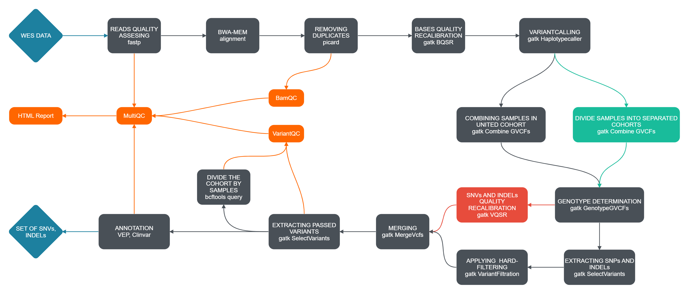

# Whole Exome Sequencing (WES) Analysis Pipeline

A comprehensive **Nextflow-based workflow** for processing and analyzing **Whole Exome Sequencing (WES)** data from NGS platforms.

## Workflow overview



This pipeline implements bioinformatics best practices and orchestrates multiple industry-standard tools to deliver **reproducible, automated, end-to-end analysis** — from raw FASTQ files to annotated variant calls.

The workflow supports **Docker** for full reproducibility and can be easily adapted for **Singularity/Apptainer** or **Conda** environments.

---

## Overview

This repository contains a robust WES processing pipeline implemented in **Nextflow**.  
It is designed for cohort-level germline variant discovery and supports flexible cohort definitions and filtering strategies.

**Key features:**

- Modular, reproducible Nextflow workflow
- Joint genotyping across cohorts
- Support for both **hard filtering** and **VQSR**
- Comprehensive QC at read, alignment, and variant levels
- Functional annotation with **VEP** and **ClinVar**
- Unified reporting with **MultiQC**

---

## Workflow Summary

The pipeline consists of the following stages:

### 1. Read Quality Assessment and Trimming
- Adapter removal and base-quality filtering using **fastp**
- Generates `.html` and `.json` QC reports for each sample

### 2. Alignment
- Maps cleaned reads to the reference genome using **BWA-MEM2**

### 3. Duplicate Removal
- Identifies and marks PCR duplicates using **Picard MarkDuplicates**

### 4. Alignment Quality Control
- Generates per-sample BAM-level QC metrics using **Qualimap `bamqc`**
- Outputs a dedicated QC directory for each sample

### 5. Base Quality Score Recalibration (BQSR)
- Corrects systematic sequencing biases using **GATK BaseRecalibrator**
- Requires **dbSNP** as a known-sites resource (GRCh38)

### 6. Variant Calling (per sample)
- Calls germline variants using **GATK HaplotypeCaller** in **GVCF mode**

---

### 7. Combining Samples

Two cohort modes are supported:

#### 7.1 United mode
- Combines all sample GVCFs into a single cohort using **GATK CombineGVCFs**
- Default mode

#### 7.2 Divided mode
- Splits samples into multiple cohorts defined by a `.csv` file
- Requires a separation table (`--septable`)
- Each cohort is processed independently

### 8. Joint Genotyping
- Performs joint genotyping with **GATK GenotypeGVCFs**

---

### 9. Variant Filtering

Two filtering strategies are available:

#### 9.1 Hard Filtering
- Applies predefined hard filters for **SNPs** and **INDELs** separately
- Implemented with **GATK VariantFiltration**
- Suitable for **small cohorts (<30 WES samples)**
- Does not require training resources
- Runs in `--filter hard`

#### 9.2 Variant Quality Score Recalibration (VQSR)
- Applies machine-learning-based recalibration for **SNPs** and **INDELs** separately
- Implemented with **GATK VQSR**
- Requires multiple training resources
- Recalibrated VCFs are merged using **Picard MergeVcfs**
- Runs in `--filter vqsr` mode

### 10. Merging
- Merges **SNPs** and **INDELs** into back into one cohort
- Implemented with **GATK MergeVcfs**

### 11. Selecting variants
- Remove all variants which **did not pass** applied filters
- Implemented with **GATK SelectVariants**
---

### 12. Variant-Level Quality Control

#### 12.1 Per-sample VCF QC**
- Extracts individual sample VCFs from the cohort (`--group united` mode only)

#### 12.2 Cohort QC
- Generates variant statistics using **bcftools stats**
- Produces `.stats` files with summary metrics

---

### 13. Functional Annotation

- Annotates variants using **Ensembl VEP**
- Integrates **ClinVar** annotations via VEP plugin

### 14. MultiQC Report

- Aggregates QC outputs from:
  - fastp
  - Qualimap
  - bcftools
  - VEP
- Generates a single interactive **MultiQC HTML report**

---

## Usage

### Quick Start

```bash
nextflow run main.nf
```

## Options (Flags)

### Cohort mode

- `--group united`  
  Combine all samples into a single cohort (default)

- `--group divided`  
  Divide samples into multiple cohorts  
  Requires `--septable /path/to/separation_table.csv`


### Filtering mode

- `--filter hard`  
  Apply hard-defined filters (default)

- `--filter vqsr`  
  Apply VQSR machine-learning-based recalibration

### Target regions

- `--targets /path/to/exome.bed`  
  BED file with exome regions  
  (preferably defined in `nextflow.config`)


### Default Parameters

Defined in `nextflow.config`:

```text
--group united
--filter hard
```

### Advanced Example

```bash
nextflow run main.nf \
  --group divided \
  --septable /path/to/separation_table.csv \
  --filter vqsr
```

## Requirements

- **[Nextflow](https://www.nextflow.io/docs/latest/install.html)**
  
- **[Docker](https://docs.docker.com/engine/install/)**

- **Reference genome**
  - GRCh38 (FASTA + index) with **USCS prefixing** chromosome numbers (e.g., `chr1`, `chrX`, `chrM` for mitochondria)

- **Exome targets**
  - BED file with capture regions

- **BQSR / VQSR resources** (GRCh38, VCF + index)
  - dbSNP with **USCS prefixing** chromosome numbers
  - hapmap_3.3
  - 1000G_omni2.5
  - 1000G_phase1.snps.high_confidence
  - Mills_and_1000G_gold_standard.indels
  - Axiom_Exome_Plus.genotypes.all_populations.poly

- **Annotation**
  - VEP cache directory
  - ClinVar VCF + index

---

## Separation Table Format

Required for `--group divided`.

Example (`;`-separated):

| Sample_id  | cohort_name |
| ---------- | ----------- |
| Sample1_id  | cohort1_name  |
| Sample2_id  | cohort2_name  |


## Running the Pipeline

1. Install **Nextflow** and **Docker**

2. Clone the repository:
```bash
   git clone https://github.com/whosoleg/wes-nf-whosoleg
   ```
   
3. Navigate to the pipeline directory:
```bash
   cd /path/to/wes-nf-whosoleg
   ```
   
4. Edit `nextflow.config`

5. Run the pipeline with the desired options

## License

*This project is licensed under the MIT License.*
